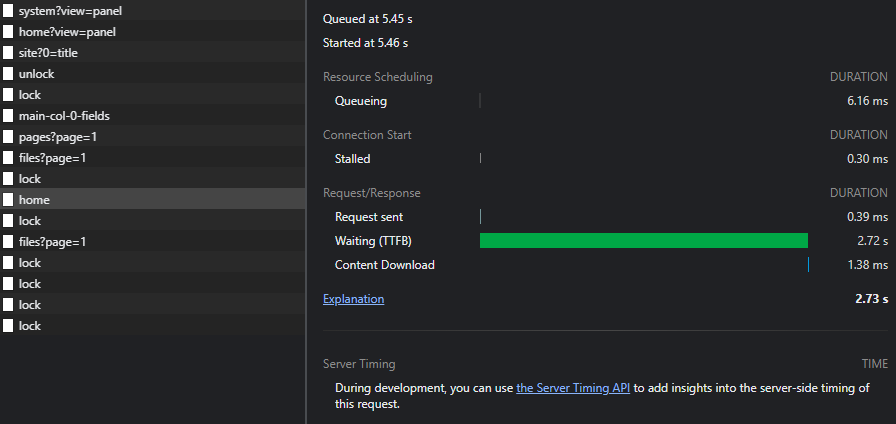

# Kirby Blocks Performance Issue

Reproduction repo for [entry #325 on Nolt](https://kirby.nolt.io/325).

This repo contains 50 custom blocks in `site/blueprints/blocks`, which are listed in `site/blueprints/pages/default.yml`. Then, 50 block instances were added to `content/home/home.txt`.

**Result:** If you make a change to any of the blocks in the page and click save, it'll take **over 2.5 seconds**:

